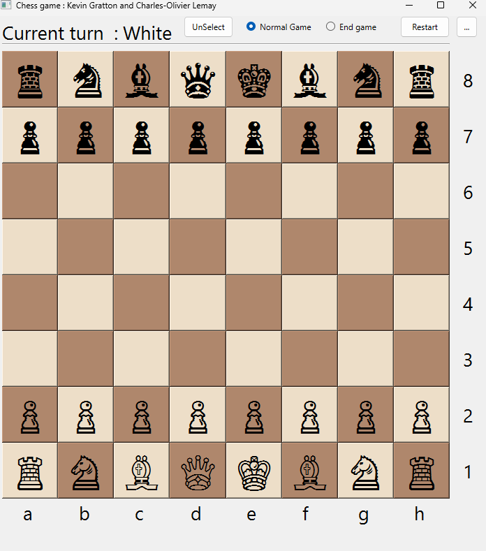
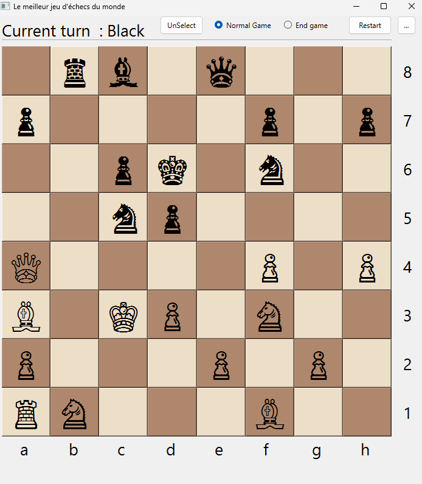

# ♟️ Simple Chess Game

## Overview

This project is a simple chess game implemented using the Qt library. It showcases the classic game of chess with a graphical user interface, allowing players to compete against each other.

## Creation

This project was a collaboration between three people. The objective was to learn and implement object-oriented programming (OOP) principles in a real-world project. Through this collaboration, we aimed to enhance our understanding of OOP and gain hands-on experience with the Qt framework.

## 📸 Screenshots

Below are a few screenshots of the game:

